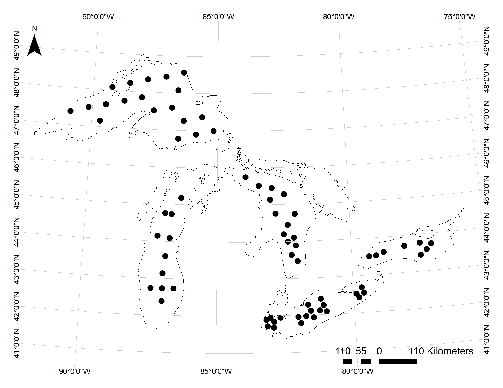
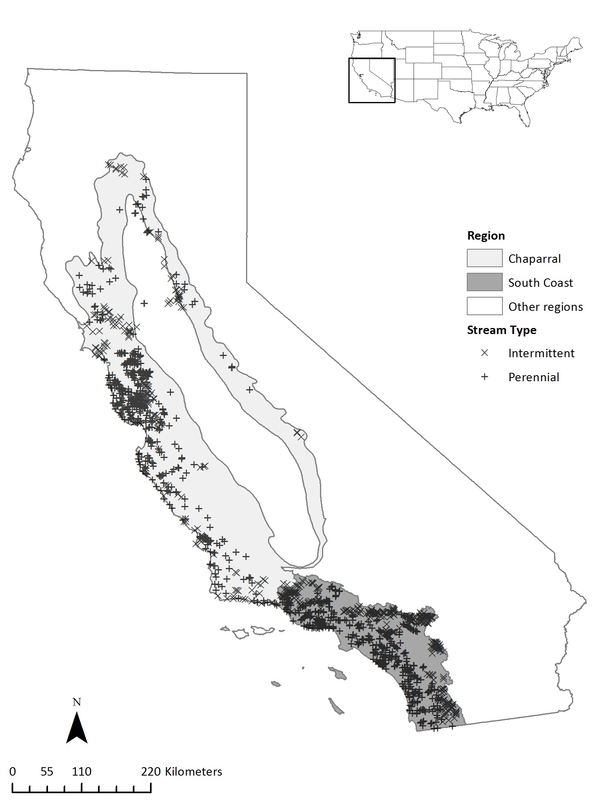
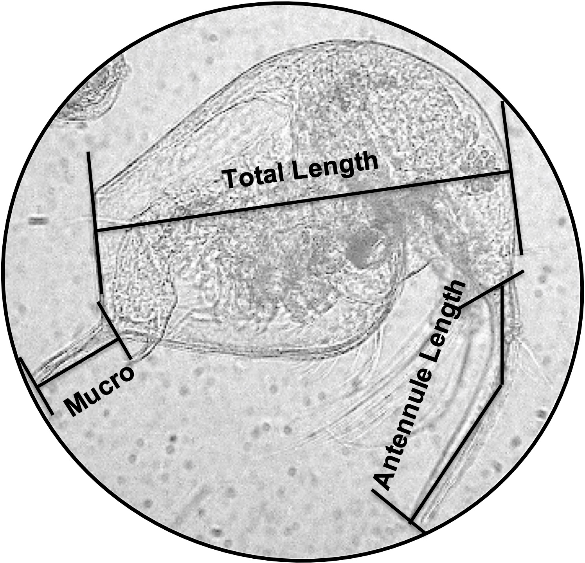

```{r setup, include=FALSE}
knitr::opts_chunk$set(echo = TRUE)
```


I am passionate about understanding freshwater ecosystems to protect and manage them into the future. My past and current projects reflect my broad interests and approaches as a researcher, practitioner, and public servant. 


<br>


<br>

### **Zooplankton as global ecosystem indicators**

I am co-leading a project on zooplankton as ecosystem indicators ([ZIG](https://sfigary.github.io/website/ZIG.html)) as part of the Global Lake Ecological Observatory Network ([GLEON](https://gleon.org/)) with over 100 aquatic researchers from around the world. Our first project will determine the effectiveness of existing zooplankton metrics (e.g., % calanoids) using a global dataset that ZIG is creating. Results from this research will provide guidance on using zooplankton as indicators in geographic regions and lake types. Look [here](https://sfigary.github.io/website/ZIG.html) to learn more about this effort and getting involved.

<br>



<br>

### **Understanding lower trophic levels in the Great Lakes**

I am using long-term existing data from the United States Environmental Protection Agency’s [Biological Monitoring Program](https://www.epa.gov/great-lakes-monitoring/great-lakes-biology-monitoring-program) to better understand the Great Lakes and how lower trophic levels have changed over time. I use this data to determine (1) if the nearshore and the offshore of Lake Ontario should be treated as different habitat types and if the habitats changed similarly over time, (2) if the precentage of the zooplankton community available for fish consumption has changed over time, and (3) the most robust use of zooplankton as ecosystem indicators based on past performance. 


<br>


<br>

<br>


### **Guiding stream restoration with modeling**

I developed a [published](https://www.sciencedirect.com/science/article/pii/S0301479720315103) spatial statistical network model of stream temperature for the Meduxnekeag Watershed that guides riparian restoration practices in the watershed to reduce stream temperature and restore coldwater habitat. The [Houlton Band of Maliseet Indians](http://www.maliseets.com/index.htm) and USEPA collaborated on this project to ensure the results could be implemented. 

<br>


<br>

<br>



<br>


<br>


### **Impervious cover impacts in watersheds**

I determined the amount of upstream impervious cover that caused changes in the stream macroinvertebrate community in both intermittent and perennial streams in the Mediterranean climate of California using Threshold Indicator Taxa ANalysis (TITAN). This is vital for developing new stormwater capture policies that are specific to and protect the high biodiversity of California. Overall, I found that the macroinvertebrate community was more sensitive to upstream development than other climatic regions in the United States that used similar study methods. 

<br>

<br>


<br>


### **Community involvement in watershed management**

I launched a volunteer community science group, Creek Watchers, with over 70 volunteers that monitored the Wissahickon watershed while at the Wissahickon Valley Watershed Association (now [Wissahickan Trails](https://wissahickontrails.org/)). Additionally, I wrote successful grants for stream restoration projects (NFWF and PA Growing Greener) and a William Penn Foundation grant to address stormwater management problems by facilitating collaboration between stakeholders including, state and local governments, waste water treatment plants, universities, and local non-profits. This work is ongoing as part of the [Delaware River Watershed Initiative](https://4states1source.org/), which aims to protect and restore the water quality of the Delaware River Watershed. (photo credit: Jamie Stewart)

<br>

<br>


<br>

### **Public administration, policy, and actionable research**

I am constantly thinking about how use my scientific training to help the environment and society by expanding the usability of my ecological research and being active in [public service](https://sfigary.github.io/website/Other.html). I completed a Master of Public Administration at the Maxwell School of Citizenship at Syracuse University. Here, I addressed watershed management policies by completing an economic cost-benefit analysis of Onondaga County’s green infrastructure program, [Save the Rain](https://savetherain.us/), compared to traditional 'grey' approaches to managing stormwater. (photo credit: Jamie Stewart)

<br>



<br>

### **Food-web disruption by non-native species**

An overarching theme in my research is studying how food webs respond to different factors, including non-native species. While at SUNY ESF, I determined the impact of *Cercopagis pengoi* in the New York Finger Lakes on their likely prey items ([published](https://www.reabic.net/aquaticinvasions/2021/issue3.aspx)) and the pattern of their invasion in the region. 
