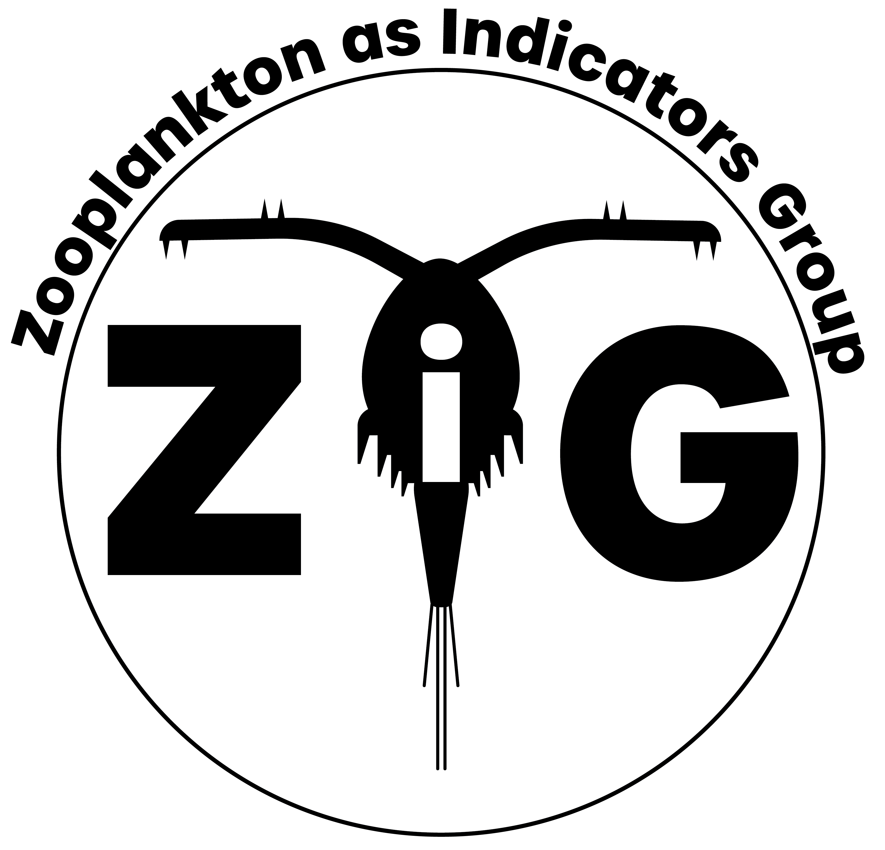
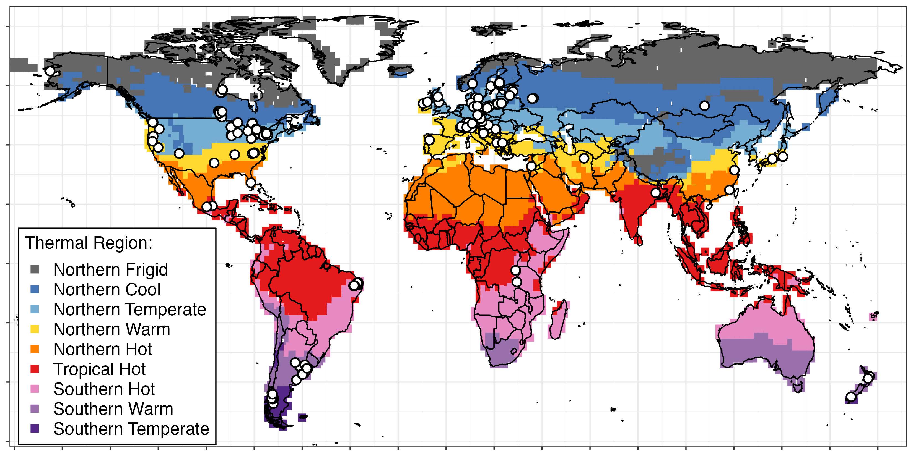

```{r setup, include=FALSE}
knitr::opts_chunk$set(echo = TRUE)
```

<center>

{width=40%}<br>{width=20%}


</center>


<left>


ZIG formed in November 2019 at the Global Lake Ecological Observatory Network [GLEON](https://gleon.org/) all-hands meeting in Huntsville, Canada with four co-champions (Steph Figary, Michael Meyer, Rachel Pilla, and Warren Currie). Since then the team has grown to ~200 aquatic scientists from around the world. The team has several goals:

1. **Develop an analysis-ready data product:** Out first goal is to develop the Zooplankton International Geospatial (ZIG) dataset. This dataset includes zooplankton community, water parameter, and waterbody characteristic data from over 280 waterbodies around the world. This analysis-ready dataset is fully harmonized, compiled, and easily linked to HydroLAKES. 

2. **Publish a main synthesis paper:** After completing the dataset it will first be used to answer ZIG's main synthesis question using data from all of the lakes. The main synthesis question addresses which aspects of zooplankton community structure are the most sensitive, and widely applicable, indicators of environmental change. All participants are welcome to contribute to the manuscript. 

3. **Launch follow-up questions:** There are so many other research questions that can be answered using the ZIG dataset, including questions on biodiversity, functional diversity, additional questions about zooplankton as indicators, and many others. After the dataset is created and the main synthesis question is addressed, the team will launch multiple follow up questions using some or all of the ZIG dataset. 

Here is a map of the submitted datasets (>290 waterbodies). 

<center>
{width=80%}

</center>

<br>

### **Interesting in getting involved?**

<br>

Please [reach out](https://sfigary.github.io/website/Contact.html)! While ZIG has closed its data call, submitting data is not required for joining the effort. Additionally, we have materials to share on on request, including the authorship guidelines/data sharing policy, meeting materials (see table below), data submission template, and data submission instructions. 


<br>

### **Project log**

<br>

```{r, echo=FALSE, message=FALSE}
library(tidyverse)

x <- readxl::read_xlsx("project_log.xlsx") 
x$Date <- format(as.Date(x$Date), "%Y-%m")


knitr::kable(x) %>%
  kableExtra::kable_styling(full_width = F)
```

<br>

### **Current project participants**

**Co-champions:** Steph Figary, Michael Meyer, Rachel Pilla, and Warren Currie

**Participants:** Adebukola Abiodun Aborigho, Rita Adrian, Javier Alcocer, María Belén Alfonso, Caitlin Andrews, Orlane Anneville, Ana Maria Antão-Geraldes, Shelley Arnott, Anita Galir Balkić, Syuhei Ban, Arnab Banerjee, Lauren Barth, John Beaver, Stella Berger, Gábor Bernát, Jessica Beyer, Ruchi Bhattacharya, Kätlin Blank, Kelly Bowen, Christer Brönmark, Matthew Brousil, Rosalie Bruel, Sarah Burnet, Tyler Butts,  Cayelan Carey, Mike Carey, Rossana Caroni, Moitreyee Chakrabarty, Sudeep Chandra, Huihuang Chen, Ariana Chiapella, Kirsten Seestern Christoffersen, Pablo Urrutia Cordero, Alicia Cortés, Maria Cristina Crispim, Elvira de Eyto, Luciana De Souza Cardoso, Bridget Deemer, Curtis DeGasperi, Braden DeMattei,  Jianming Deng, Jean-Pierre Descy, Inta Dimante-Deimantoviča, Nadia Diovisalvi, Renata Dondajewska-Pielka, Jonathan Doubek, Tvrtko Dražina, Zorka Dulic, Gaël Dur, Brie Edwards, Mariam Elmarsafy, Oxana Erina, Jolanta Ejsmont-Karabin, Zeynep Ersoy,  Rocio Fernandez, Heidrun Feuchtmayr, Janet Fischer, María Soledad Fontanarrosa, László G.-Tóth, Evelyn Gaiser, Gideon Gal, Javier Ricardi Garcia de Souza, Ali Ger, Scott Girdner,  Ryszard Gołdyn, Hans-Peter Grossart, Nelson	Hairson, David Hambright, David Hamilton, Lars-Anders Hansson, Marie-Pier Hébert, Susan Hendricks, Meredith Holgerson, Bas Ibelings, Lia Ivanick, Stéphan Jacquet, Martin Kainz, Maciej Karpowicz, Sami Khan, Jan Köhler, Katarzyna Kowalczewska-Madura, Keerthi Krutha, Natalia Kuczyńska-Kippen, Silke Langenheder, Brian Lanouette, Barbara Leoni, Fabio Lepori, Jaakko Leppänen, Shuqi Lin,  Arni Litt, Eleanor Mackay, Marina Manca, Irina Mashkova, Ichiro (Shin-ichiro) Matsuzaki, Valerie McCarthy, Yvonne McElarney, Rosemberg Menezes, Ewa Merz, Evangelia Michaloudi, Galilee Miles, Jannicke Moe, Florencia Rojas Molina, Doerthe Mueller-Navarra, Manuel Muñoz-Colmenares, Veronica Nava, Jens Nejstgaard, Ulrike Obertegger, David Ortiz, Luis Alberto Oseguera Pérez, Maria Calderó Pascual, Martina Patelli, Michael Paterson, María Cintia Piccolo, Lorena Pinheiro Silva, Roberta Piscia, Francesco Pomati, Mahima	Quazi, Serena Rasconi, Ashley Rawhouser, Brian Reid, Kevin Rose, Joanna Rosińska, Lars Rudstam, James Rusak, Olga. O. Rusanovskaya, Elizabeth Ryder, Nico Salmaso, Jouko Sarvala, Geoffrey Schladow, Anna Schmidt, Matthew Schuler, Kimberly Schulz, Anne Scofield, Facundo Scordo, Jaromir Seda, Katie Senft, S.V Shimaraeva, Eugene Silow, Maria Špoljar, Jason Stockwell, Dietmar Straile, Angela Strecker, Hilary Swain, Celia Symons, Andrew Tanentzap, Barbara Tartarotti, Stephen Thackeray, Maxim Timofeyev, Jörg Tittel, Piet Verburg, John Wade, Nicholas Walling, Robert	Walsh, Heather Wander, James Watkins, David White, Katharina Winter, Sabine Wollrab, Jun Yang, Vivian Yorojo, Horacio Zagarese, Matiss Zagars, and Petr Znachor

**Partner GLEON projects:** [Zooplankton over Space and Time](https://gleon.org/research/projects/zoost-zooplankton-over-space-and-time) and [Zooplankton Size](https://rosalieb.github.io/rosaliebruelweb/ZooSize.html)