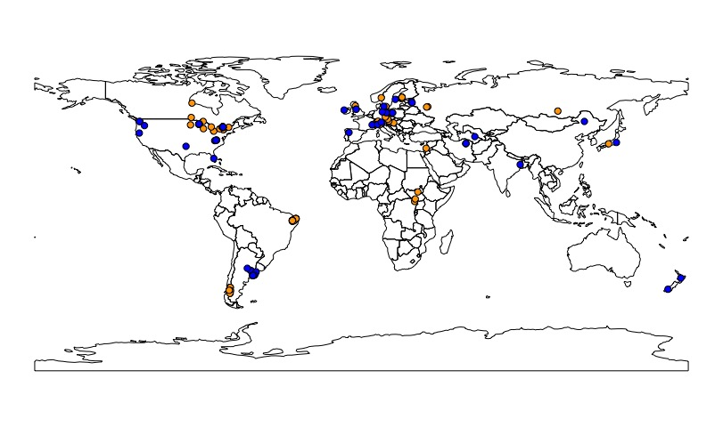

```{r setup, include=FALSE}
knitr::opts_chunk$set(echo = TRUE)
```

<center>
{width=30%}

</center>

<left>

# Zooplankton as Indicators Group (ZIG)

<br>


ZIG was formed in November 2019 at the Global Lake Ecological Observatory Network [GLEON](https://gleon.org/) all-hands meeting in Huntsville, Canada with three co-leads (Steph Figary, Michael Meyer, and Warren Currie) and has since grown to a team of over 100 aquatic scientists from around the world interested in understanding the uses of zooplankton as indicators in lakes and reservoirs. This project has several goals:

1. **Develop a global dataset:** Our goal is to develop a global zooplankton dataset to test which aspects of zooplankton community structure are the most sensitive, and widely applicable, indicators of environmental change. ZIG’s data call to GLEON can be found [here](ZIG_datacall.pdf). After harmonizing all of the submitted datasets using github, ZIG will publish a data product with the data that can be made public.

2. **Publish a main synthesis paper:** The main goal of ZIG is to determine the reliability of existing zooplankton indicators (e.g., % calanoids) on a global scale using existing data from the GLEON network. This will be written and submitted as the ‘main synthesis paper’ that all participants are welcome to contribute to. 

3. **Launch follow-up questions:** There are many additional questions that the ZIG global dataset can be used to answer about zooplankton as indicators. After the first two goals of the project are met, ZIG's focus will shift to the follow up questions that ZIG participants have outlined. We see the potential for these collaborations to continue well into the future.

Here's a map of our submitted (blue) and expected (orange) datasets. We are still looking for new collaborators in the regions without dataset coverage.

<center>
{width=80%}

</center>

<br>

## Interesting in getting involved or submitting data?

<br>

Please [reach out](https://sfigary.github.io/website/Contact.html)! ZIG is still accepting new members and datasets. Submitting data is not required for joining the effort. Additionally, we have materials to share on on request, including the authorship guidelines/data sharing policy, meeting materials (see table below), data submission template, and data submission instructions. 


<br>

## Project log 

<br>

```{r, echo=FALSE}
knitr::kable(read.csv("project_log.csv"))
```

