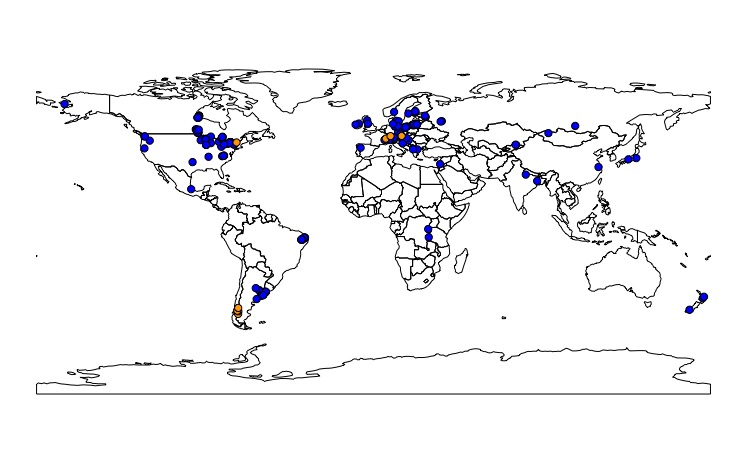

```{r setup, include=FALSE}
knitr::opts_chunk$set(echo = TRUE)
```


<center>
{width=30%}

</center>

<left>


<br>


ZIG was formed in November 2019 at the Global Lake Ecological Observatory Network [GLEON](https://gleon.org/) all-hands meeting in Huntsville, Canada with three co-champions (Steph Figary, Michael Meyer, and Warren Currie) and has since grown to a team of over 130 aquatic scientists from around the world interested in understanding the uses of zooplankton as indicators in lakes and reservoirs. This project has several goals:

1. **Develop a global dataset:** Our goal is to develop a global zooplankton dataset to test which aspects of zooplankton community structure are the most sensitive, and widely applicable, indicators of environmental change. ZIG’s data call to GLEON can be found [here](ZIG_datacall.pdf). After harmonizing all of the submitted datasets using github, ZIG will publish a data product with the data that can be made public.

2. **Publish a main synthesis paper:** The main goal of ZIG is to determine the reliability of existing zooplankton indicators (e.g. % calanoids as an indicator of lake trophic state) on a global scale using existing data from the GLEON network. This will be written and submitted as the ‘main synthesis paper’ that all participants are welcome to contribute to. 

3. **Launch follow-up questions:** There are many additional questions that the ZIG global dataset can be used to answer about zooplankton as indicators. After the first two goals of the project are met, ZIG's focus will shift to the follow up questions that members have outlined. We see the potential for these collaborations to continue well into the future.

Here's a map of our submitted (blue, >270 lakes) and expected (orange, <10) datasets. We are still looking for new collaborators in the regions with poor dataset coverage.

<center>
{width=80%}

</center>

<br>

### **Interesting in getting involved or submitting data?**

<br>

Please [reach out](https://sfigary.github.io/website/Contact.html)! While ZIG has closed its data call, we are still accepting new members and datasets from regions with poor dataset coverage. Submitting data is not required for joining the effort. Additionally, we have materials to share on on request, including the authorship guidelines/data sharing policy, meeting materials (see table below), data submission template, and data submission instructions. 


<br>

### **Project log**

<br>

```{r, echo=FALSE, message=FALSE}
library(tidyverse)

knitr::kable(read.csv("project_log.csv")) %>%
  kableExtra::kable_styling(full_width = F)
```

<br>

### **Current project participants**

**Co-champions:** Steph Figary, Michael Meyer and Warren Currie

**Participants:** Rita Adrian, Javier Alcocer, María Belén Alfonso, Orlane Anneville, Carmen Archambault, Shelley Arnott, Anita Galir Balkić, Arnab Banerjee, Lauren Barth, John Beaver, Stella Berger, Gábor Bernát, Jessica Beyer, Ruchi Bhattacharya, Kätlin Blank, Kelly Bowen, Matthew Brousil, Rosalie Bruel, Sarah Burnet, Cayelan Carey, Mike Carey, Rossana Caroni, Sudeep Chandra, Ariana Chiapella, Kirsten Seestern Christoffersen, Pablo Urrutia Cordero, Cristina Crispim, Curtis DeGasperi, Jianming Deng, Jean-Pierre Descy, Inta Dimante-Deimantoviča, Nadia Diovisalvi, Renata Dondajewska-Pielka, Jonathan Doubek, Tvrtko Dražina, Gaël Dur, Brie Edwards, Mariam Elmarsafy, Oxana Erina, Elvira de Eyto, Rocio Fernandez, Heidrun Feuchtmayr, Janet Fischer, María Soledad Fontanarrosa, László G.-Tóth, Evelyn Gaiser, Gideon Gal, Javier Garcia de Souza, Ali Ger, Ana Maria Antão-Geraldes, Ryszard Gołdyn, Hans-Peter Grossart, David Hambright, David Hamilton, Yvonne Hammond, Susan Hendricks, Meredith Holgerson, Bas Ibelings, Lia Ivanick, Stéphan Jacquet, Martin Kainz, Maciej Karpowicz, Sami Khan, Jan Köhler, Katarzyna Kowalczewska-Madura, Keerthi Krutha, Natalia Kuczyńska-Kippen, Silke Langenheder, Brian Lanouette, Barbara Leoni, Fabio Lepori, Jaakko Leppänen, Arni Litt, Eleanor Mackay, Marina Manca, Irina Mashkova, Ichiro (Shin-ichiro) Matsuzaki, Valerie McCarthy, Rosemberg Menezes, Ewa Merz, Evangelia Michaloudi, Galilee Miles, Jannicke Moe, Florencia Rojas Molina, Samuel Motitsoe, Doerthe Mueller-Navarra, Veronica Nava, Jens Nejstgaard, Ulrike Obertegger, Luis Alberto Oseguera Pérez, Maria Calderó Pascual, Martina Patelli, Michael Paterson, María Cintia Piccolo, Lorena Pinheiro Silva, Roberta Piscia, Serena Rasconi, Ashley Rawhouser, Brian Reid, Joanna Rosińska, Lars Rudstam, James Rusak, Elizabeth Ryder, Nico Salmaso, Jouko Sarvala, Anna Schmidt, Matthew Schuler, Kimberly Schulz, Anne Scofield, Facundo Scordo, Jaromir Seda, Maria Špoljar, Jason Stockwell, Dietmar Straile, Angela Strecker, Hilary Swain, Celia Symons, Andrew Tanentzap, Barbara Tartarotti, Stephen Thackeray, Wim Thiery, Maxim Timofeyev, Jörg Tittel, Reliana Lumban Toruan, Piet Verburg, Nicholas Walling, Heather Wander, James Watkins, David White, Katharina Winter, Sabine Wollrab, Vivian Yorojo, Horacio Zagarese, Petr Znachor

**Partner GLEON projects:** [Zooplankton over Space and Time](https://gleon.org/research/projects/zoost-zooplankton-over-space-and-time) and [Zooplankton Size](https://rosalieb.github.io/rosaliebruelweb/ZooSize.html)