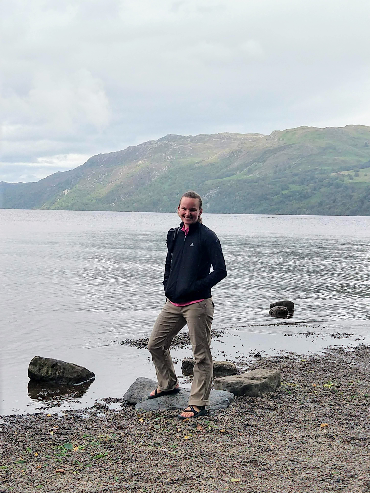

```{r setup, include=FALSE}
knitr::opts_chunk$set(echo = TRUE)
```

<br>




<br>

I am a freshwater ecologist with a background in public administration (MPA). For my doctoral dissertation, I am using long-term monitoring datasets to understand the lower trophic levels of the Great Lakes. Additionally, I am a co-lead of the [GLEON](https://gleon.org/) Zooplankton as Indicators Group ([ZIG](https://sfigary.github.io/website/ZIG.html)) that is developing a zooplankton dataset to investigate the use of zooplankton as indicators of ecological condition at a global scale.

Please see my [research](https://sfigary.github.io/website/Research.html) interests for more information and [reach out](https://sfigary.github.io/website/Contact.html) if you have any questions.

<br>

